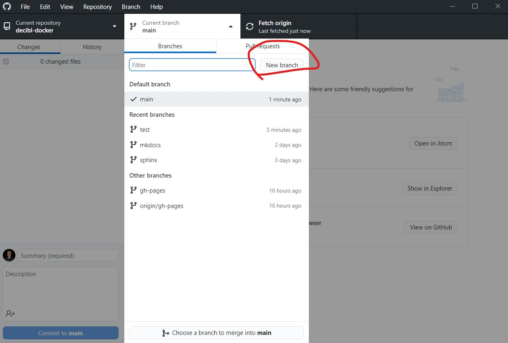
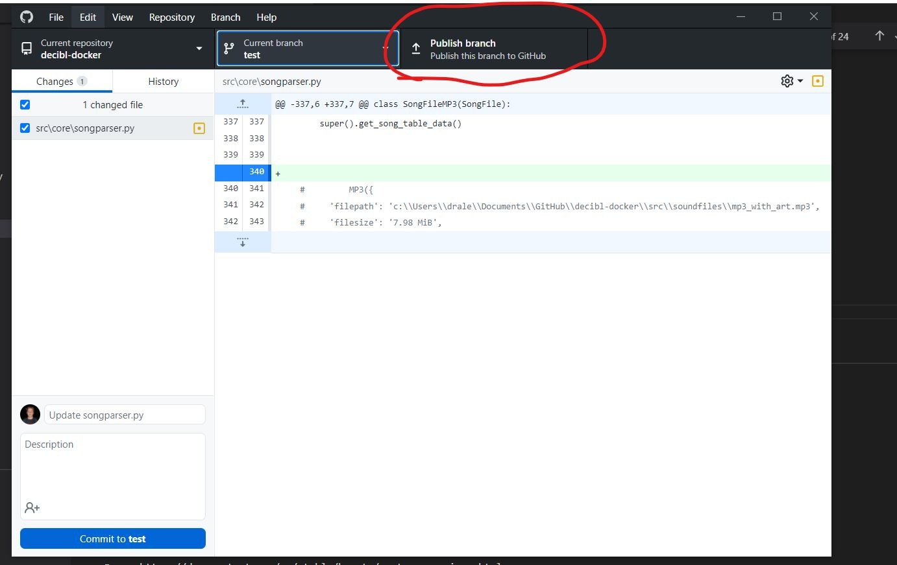
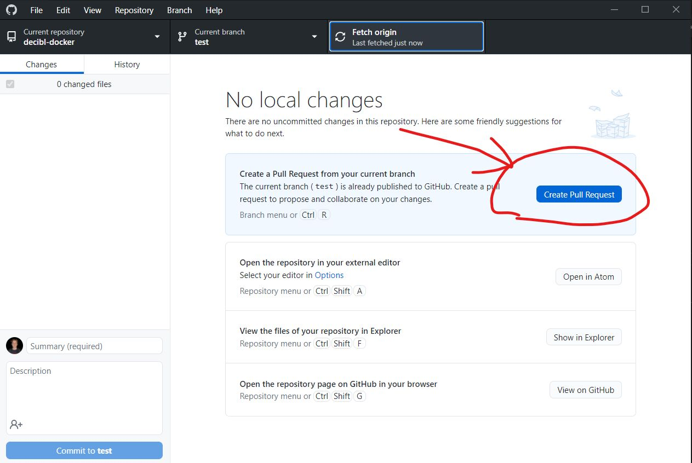
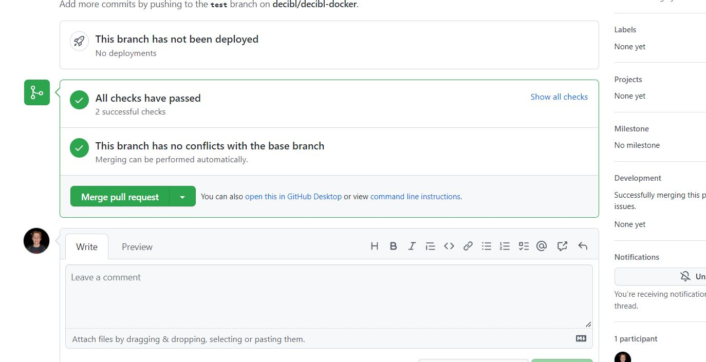

Okay, you just wrote some awesome code, now you want to commit it to the repository. This is a quick guide on how to do that.

We are using a system that **requires** making an additional **branch** and **merging** it with the main branch. This is to ensure that the main branch is always stable and working. Tests are automatically ran to make sure your changes didn't break anything.

Here's a step-by-step guide on how to do that:

### Step 1: Create a branch

Before or after you make your changes, you need to create a branch. You can do this in GitHub Desktop very easily:

<figure markdown>
  {loading=lazy}
  <figcaption>Create a new branch in GitHub Desktop</figcaption>
</figure>

### Step 2: Add your changes and push the new branch to GitHub

After you've made your changes, you need to add them to the branch. Commit them to the branch by the usual method (make sure you're on the new branch you made) then push the branch to GitHub.

<figure markdown>
  {loading=lazy}
  <figcaption>Commit your changes to the new branch</figcaption>
</figure>

### Step 3: Create a pull request

After you've pushed your branch to GitHub, you need to create a pull request. This is done by clicking the "Pull request" button on GitHub Desktop or the web client.

<figure markdown>
  {loading=lazy}
  <figcaption>Create a pull request</figcaption>
</figure>

### Step 4: Merge the pull request

We have automatic tests that must be passed by your changes so you don't break anything. If they pass, you can merge your pull request. If they don't, you need to fix your code.

<figure markdown>
  {loading=lazy}
  <figcaption>Wait for the pull request to be merged</figcaption>
</figure>

### Step 5: Done!

After your pull request is merged, your code is on the main branch. The old branch is automatically deleted.